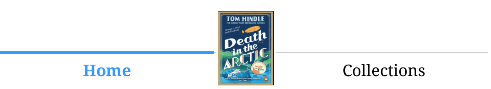

# KOReader-Patches-
KOReader Patches I modified from existing ones I use aswell as a new one I made for page counts using sdr data based on SeriousHornet's page count badge style & one inspired by qewer33's navigation bar 

_Verified to work with KOReader v2025.10 and Project: Title (except 2-book-cover-navbar.lua, this does not work with Project:Title)_

_*must also use [2--disable-all-PT-widgets.lua](https://github.com/SeriousHornet/KOReader.patches/blob/main/2--disable-all-PT-widgets.lua) by SeriousHornet in order for most of these to work_

**[2-pages-badge-sdr.lua](https://github.com/koboprincess/KOReader-Patches-/blob/main/2-progress-bar-trigger.lua)** 

Patch uses sdr file from book metadata to generate a page count and display it on the bottom left cover of books in file manager

To generate the page count, the book needs to be opened at least once and KOReader then needs to be restarted 

**Pros:** 
> If you change your font size or margins the page count will be recalculated

> No more messing around in Calibre trying to get the page counts to calculate and no need to age the page count in the filename

**Cons:** 
> The book will be marked as 'reading' in your library and resetting it will remove the sdr file and therefore the page count will disappear 

**Solution:**
> If you are using an icon on books to mark them as 'reading' you can change this with a blank .svg file; I have modified SeriousHornet's 2-new-progress-bar.lua patch and 2-percent-badge.lua to include a trigger that will only let them display when the book has been read past 2% (the % can be user modified if desired - see relevent below section for details)

**[2-percent-badge-trigger.lua](https://github.com/koboprincess/KOReader-Patches-/blob/main/2-percent-badge-trigger.lua)**

Modification of SeriousHornet's 2-percent-badge.lua to include a trigger that only allows the percent badge to appear on the book cover when it has been read past 2% 

_***Make sure to download the precent.badge svg file from the icons folder and add to your icons folder**_

The trigger % can be changed by the user if desired in line 42 of the lua file: 
>         if self.is_directory or self.status == "complete" or not self.percent_finished or (self.percent_finished * 100 < 2)

> _example: changing the '2' to a '4' would trigger it at 4%_

**[2-progress-bar-trigger.lua](https://github.com/koboprincess/KOReader-Patches-/blob/main/2-progress-bar-trigger.lua)** 

Modification of SeriousHornet's 2-new-progress-bar.lua to include a trigger that only allows the progress bar to appear on the book cover when it has been read past 2% 

The trigger % can be changed by the user as for above patch if desired in line 52 of the lua file: 

>         if not target or not target.dimen or not pf or (pf * 100 < 2)

**[2-stacked-folder-covers.lua](https://github.com/koboprincess/KOReader-Patches-/blob/main/2-stacked-rounded-folder-covers.lua)**

Modification of SeriousHornet's 2-rounded-folder-covers.lua to include a 'stack' effect by drawing 3 lines above the folder cover

_***Make sure to download the rounded corner svg files from the icons folder and add to your icons folder**_

The lines, spacing etc. can be modified in the section from line 420 in the lua file: 

> --=================== Draw grey lines above folder cover ===================
> 
> local LINE_COLOR    = Blitbuffer.COLOR_GRAY_3
> 
> local LINE_HEIGHT   = 4                              -- thickness of lines
> 
> local LINE_SPACING  = Screen:scaleBySize(2)          -- space between stacked lines
> 
> local COVER_GAP     = Screen:scaleBySize(2)          -- gap between cover and bottom line\
> 
> -- Define your line widths here (bottom → top order)
> 
> -- Add/remove numbers to change how many lines you want
> 
> local LINE_WIDTHS = {
> 
>   280,   -- bottom line (closest to cover)
> 
>   250,   -- middle line
> 
>   220,   -- top line

_*The lines are currently set with widths that work with my 2 x 3 mosaic layout, the line sizes will need to be modified for other layouts_

**[Icons](https://github.com/koboprincess/KOReader-Patches-/tree/main/Icons)**

These icons are all in the icons folder - just save them into your icons folder in KOReader :) 

**[2-book-cover-navbar.lua](https://github.com/koboprincess/KOReader-Patches-/blob/90badeb01b1b8e155968cdb083c49b56b83c091f/2-book-cover-navbar.lua)**

_*not compatible with Project:Title_

Thanks to qewer33 whose navigation bar patch gave me the idea to modify it into a Kindle-esque one as I love the idea of being able to display my most recent read and click it to get back to it!

The patch uses the book cover from the sdr folder - it will only work if you have custom book covers set, otherwise the covers are hardcoded and don't exist as separate files in the metadata so the patch won't 'see' them - covers can be .jpg or .png

Certain parameters may need to be adjusted for different screen sizes, currently optimised for Kobo Clara Colour

**[2-highlight-menu-modifications-edit.lua](https://github.com/koboprincess/KOReader-Patches-/blob/1e93156d105b54c08e8335833340a317cec5168f/2-highlight-menu-modifications-edit.lua)**  

My edit of Veebui's/erildt's highlight menu patch - make sure to save the icons from my icons folder and add to your icons folder in Koreader

_***important! If you want a single row bar like in the above picture, you need to edit line 1511 in readerhighlight.lua to change 'local columns' to 8**_

 
 
